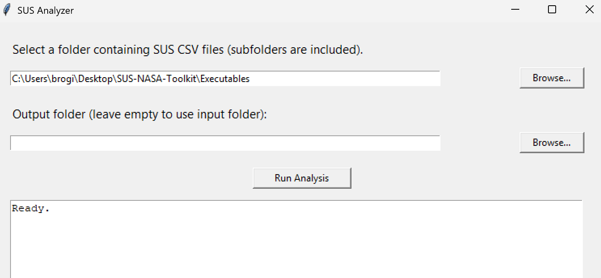
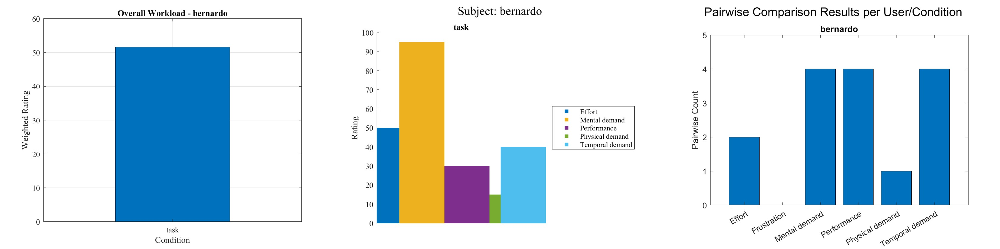
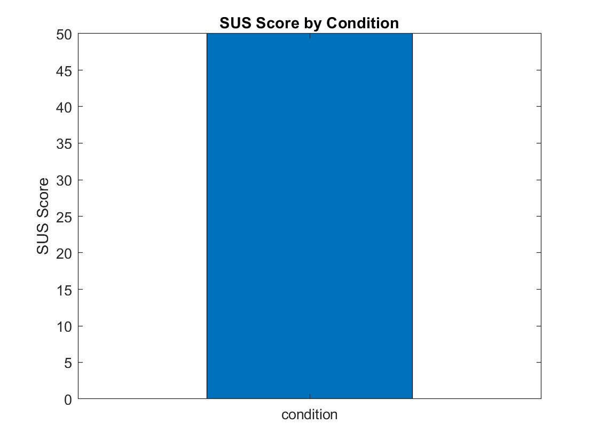

# SUS-NASA-Toolkit
Open-source toolkit for collecting, scoring, and visualizing System Usability Scale (SUS) and NASA-TLX results.

## Online questionnaire
Use the web app to perform the SUS and NASA-TLX questionnaires:

- Website: https://lelox93.github.io/NASA_TLX_TaInCo/

After finishing a questionnaire the site exports CSV files which can be analyzed with the scripts included in this repository.

## Repository structure

- `Executables/` — compiled Python executables that let you select an input folder containing SUS or NASA CSV files and an output folder; they run the analysis and save plots plus computed CSV result files.

An example is shown here with the SUS executable:

<p align="center"></p>


- `NASA/`
	- `nasa_analysis.m` — MATLAB script to analyze NASA-TLX CSV files.
	- `data_csv/` — CSV exports (examples: `bernardo_task_PW.csv`, `bernardo_task_RS.csv`).
	- `function/` — helper import functions (`importfilePW.m`, `importfileRS.m`).
- `SUS/`
	- `sus_analysis.m` — MATLAB script to analyze SUS CSV files.
	- `data_csv/` — CSV exports (example: `bernardo_KNSC_sus.csv`).

## MATLAB analysis scripts

- **[NASA/nasa_analysis.m](NASA/nasa_analysis.m)**: parses CSV files in `NASA/data_csv` to detect users, test types and trial conditions; computes NASA-TLX weights and weighted ratings per axis by combining pairwise (PW) counts (from `importfilePW`) and rating scales (from `importfileRS`); builds per-subject and per-condition tables, saves results to `NASA_TLX_weighted_scores.mat` and `NASA_TLX_weighted_scores.csv`; produces plots including per-user overall workload (bar of weighted ratings), category-wise ratings per axis, and pairwise comparison bar plots.

<p align="center"></p>

- **[SUS/sus_analysis.m](SUS/sus_analysis.m)**: reads SUS CSV responses in `SUS/data_csv`, extracts user and condition from filenames, computes each subject's SUS score using the standard formula (odd items: score-1; even items: 5-score; total * 2.5); assembles long and wide tables (filters users with all conditions), creates boxplots (or bar plots for single-subject) of SUS scores by condition, and computes descriptive statistics (quartiles and whiskers) for each condition.

<p align="center"></p>


## MatLab Usage

1. Open MATLAB and add the repository to the path or change the working directory to the project root.
2. Place the exported CSV files from the questionnaire in the appropriate `data_csv/` folder.
3. Run the analysis script in MATLAB, for example:

```matlab
run('NASA/nasa_analysis.m')
% or
run('SUS/sus_analysis.m')
```

Check the top of each script for configurable options (file names, plotting flags, output locations).

